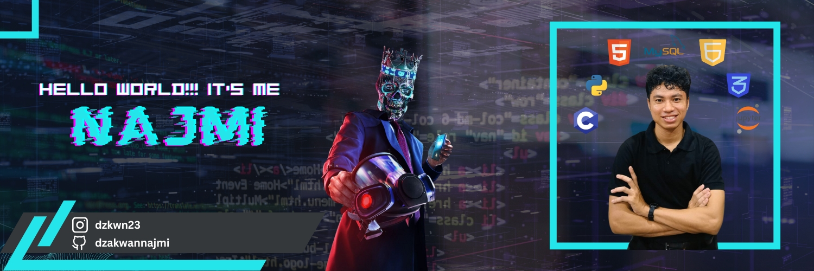

# Hi!!! I'm Muhammad Dzakwan Najmi 👋

  

###

<h3 align="center">💻 Skills</h3>

###

  
  
  
  
  
  
  
  
  
  
  
  
  
  
  

###

<h3 align="center">📊My Github Stats</h3>

###

  
  
  
  

###

###

###

###

###

<h3 align="left">🌐 Connect With Me</h3>

###

  

###