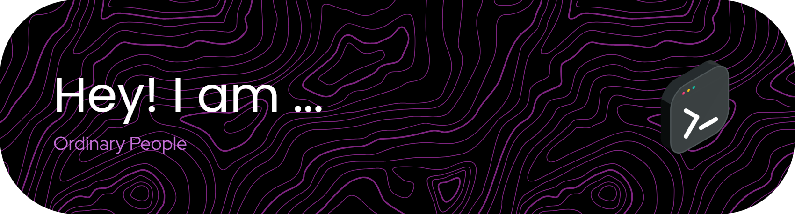

<link rel="preconnect" href="https://fonts.googleapis.com">
<link rel="preconnect" href="https://fonts.gstatic.com" crossorigin>
<link href="https://fonts.googleapis.com/css2?family=Poppins:ital,wght@0,100;0,200;0,300;0,400;0,500;0,600;0,700;0,800;0,900;1,100;1,200;1,300;1,400;1,500;1,600;1,700;1,800;1,900&display=swap" rel="stylesheet">

<!--  -->

<h1 align="left">Hey There👋</h1>

Hello, I am Muhammad Dzakwan Najmi. I'm a student at Universitas Islam Kalimantan Muhammad Arsyad Al-Banjari. I'm just a regular person who eats rice.

<!-- Quotes -->

<h2 align="center">📖 Quotes</h2>

<!-- Stacks -->
<h2 align="center">⚙️ Tech Stacks</h2>

  

<!-- Stats -->
<h2 align="center">📊My Github Stats</h2>

  

  

  <!--  -->

<!-- Mini Games -->
<h2 align="center">🎮 Play Mini-Game!!!</h2>

<!-- abozanona -->
<picture>
  <source media="(prefers-color-scheme: dark)" srcset="https://raw.githubusercontent.com/abozanona/abozanona/output/pacman-contribution-graph-dark.svg">
  <source media="(prefers-color-scheme: light)" srcset="https://raw.githubusercontent.com/abozanona/abozanona/output/pacman-contribution-graph.svg">
  
</picture>

<picture>
  <source media="(prefers-color-scheme: dark)" srcset="https://raw.githubusercontent.com/dzakwannajmi/dzakwannajmi/output/pacman-contribution-graph-dark.svg">
  <source media="(prefers-color-scheme: light)" srcset="https://raw.githubusercontent.com/dzakwannajmi/dzakwannajmi/output/pacman-contribution-graph.svg">
</picture>

<!-- Music -->
<h2 align="center">🎶 Listen With Me</h2>

  

<!-- Social Media -->
<h2 align="center">🌐 Connect With Me</h2>

  
  
  

<!-- Other -->
